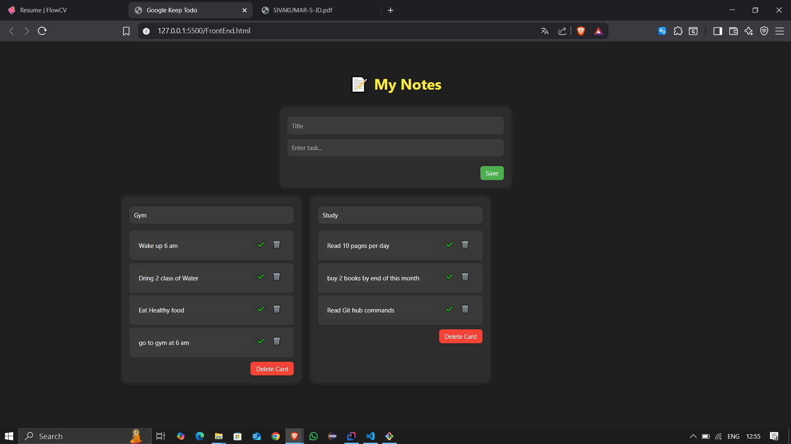

# 📝 Todo List - Full Stack Web App

A simple and elegant Todo List web application built with **Spring Boot** for the backend and **HTML/CSS/JavaScript** for the frontend.
It supports creating task cards (with or without titles), marking tasks as complete/incomplete, editing, and deleting both tasks and cards.

---

## 🔧 Features

- ✅ Add tasks with or without titles
- ✅ Create multiple cards (like Google Keep style)
- ✅ Edit task text or card title
- ✅ Mark tasks as completed/incomplete
- ✅ Delete individual tasks or entire cards
- ✅ Responsive UI with a dark theme

---

## 🛠 Tech Stack

| Layer         | Technology         |
|---------------|--------------------|
| Backend       | Java, Spring Boot, Spring Data JPA |
| Database      | H2 (in-memory) / MySQL (optional) |
| Frontend      | HTML, CSS, JavaScript (Vanilla) |
| Tools         | Postman, Git, GitHub |

---

